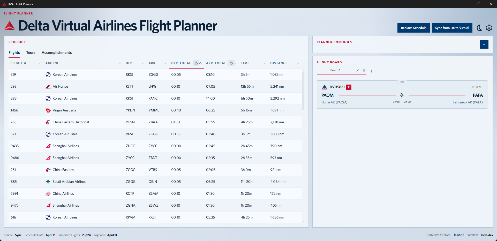
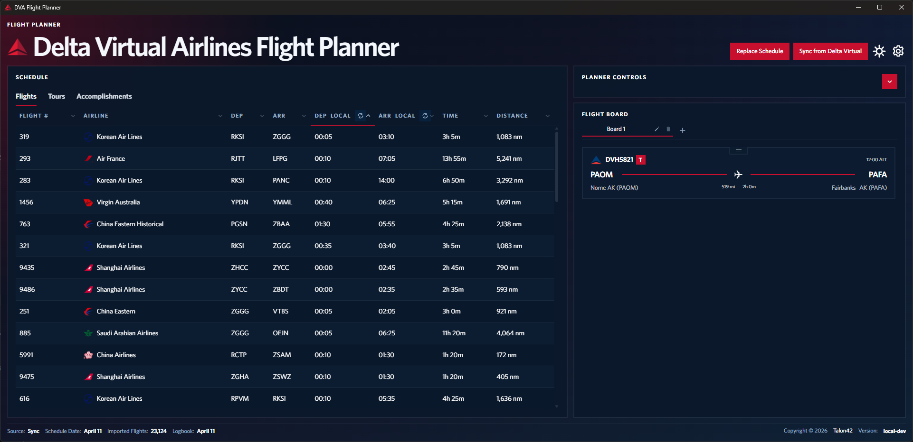
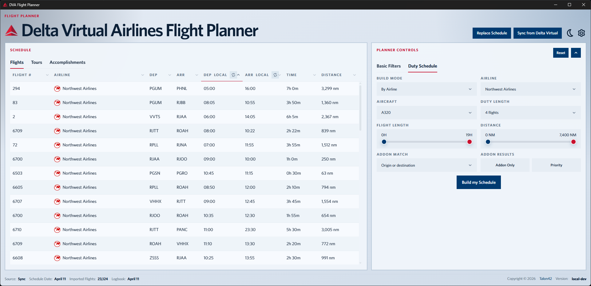
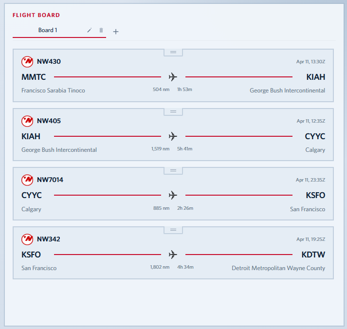
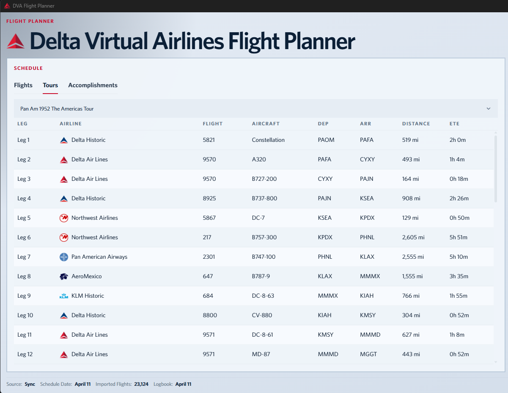
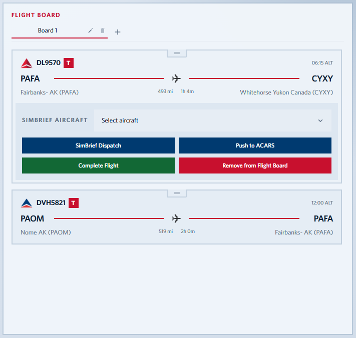
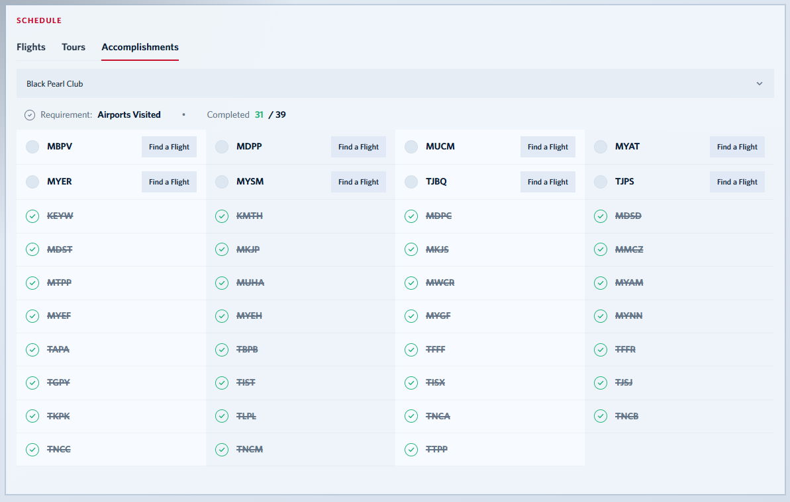
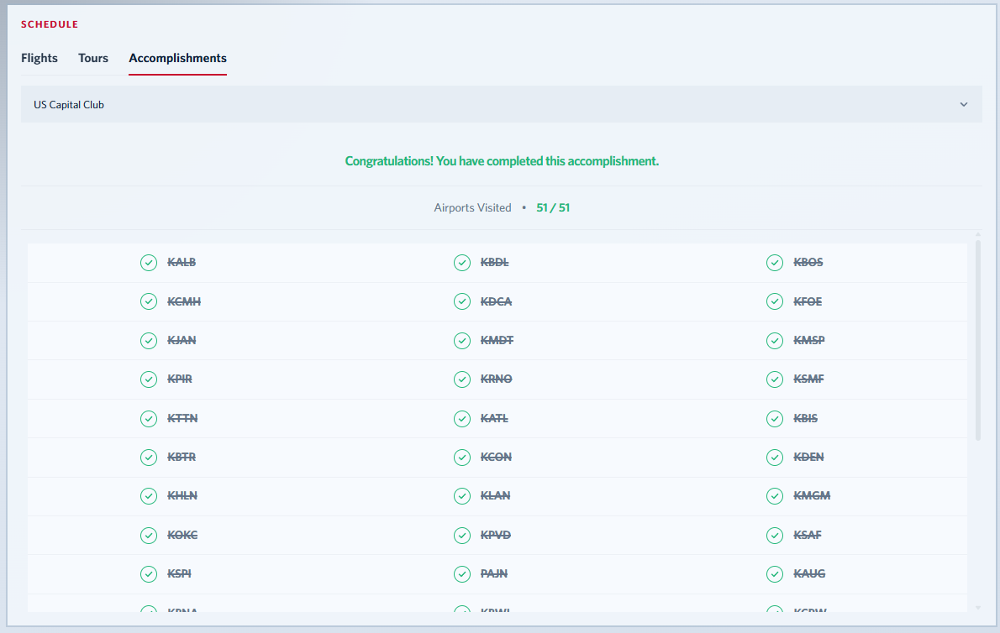
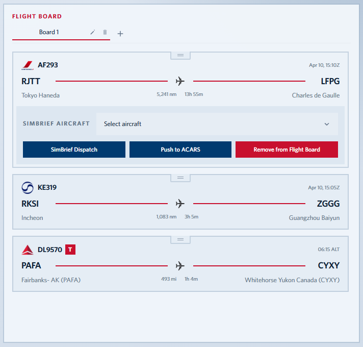

# Delta Virtual Airlines Flight Planner

Desktop flight planning tool for Delta Virtual Airlines schedules.

Hi, I'm Jacob! I have been with Delta Virtual Airlines (`DVA11384`) since 2013, and I built this app to make schedule filtering, flight selection, and board management faster, more practical, and fun for day-to-day planning.

## Table of Contents

- [What It Does](#what-it-does)
- [Quick Start](#quick-start)
- [Syncing from Delta Virtual](#syncing-from-delta-virtual)
- [Addon Folder Support](#addon-folder-support)
- [Standard Filters](#standard-filters)
- [Duty Schedule Feature](#duty-schedule-feature)
- [Schedule Table](#schedule-table)
- [Tours Tab](#tours-tab)
- [Accomplishments Tab](#accomplishments-tab)
- [Flight Board](#flight-board)
- [Flight Board Repair](#flight-board-repair)
- [SimBrief Dispatch](#simbrief-dispatch)

## Disclaimer

For flight simulation purposes only. Not a commercial application. In no way is this application affiliated with Delta Air Lines, its affiliates, or any other airline. All logos, images, and trademarks remain the property of their respective owners.

## What It Does

- Imports a Delta Virtual PFPX schedule XML
- Filters flights by route, geography, time, distance, and aircraft compatibility
- Scans your MSFS addon folders and uses that airport coverage in filtering
- Builds a connected duty schedule
- Lets you maintain a persistent Flight Board between sessions
- Lets you drag Flight Board cards to reorder your working sequence
- Includes a Tours tab with DVA tour legs and local completion tracking
- Includes an Accomplishments tab with DVA accomplishment airport checklist tracking
- Supports direct schedule and logbook sync from the Delta Virtual website
- Supports SimBrief dispatch from Flight Board entries
- Supports saved custom SimBrief airframes mapped to specific aircraft types

<table>
  <tr>
    <td align="center">
      
    </td>
    <td align="center">
      
    </td>
  </tr>
</table>

## Windows SmartScreen Warning

When you launch the `.exe`, Windows may show a `Microsoft Defender SmartScreen` warning such as `Windows protected your PC`.

That warning is common for small or newly released Windows applications that are not code-signed or do not yet have enough download reputation with Microsoft. It does not automatically mean the app is malicious.

This app is a niche desktop tool distributed directly through this repository, so SmartScreen may warn even when the executable is the expected release build.

If you downloaded the release from this repository, click `More info`, then click `Run anyway`.

## Quick Start

1. Open the app.
2. Import a schedule:
   - `Import Schedule XML` to load a PFPX XML manually, or
   - `Sync from Delta Virtual` to download it directly from DVA.
3. Review the schedule table.
4. Use `Basic Filters` or `Duty Schedule`.
5. Double-click a flight to add it to the Flight Board.
6. Drag Flight Board cards to reorder them if needed.
7. Expand a Flight Board entry to dispatch, repair, or remove it.

## Importing a PFPX XML Manually

1. Download your PFPX schedule XML from the Delta Virtual Airlines website.
2. Click `Import Schedule XML`.
3. Select the XML file.
4. The app will:
   - parse each `<FLIGHT>` entry
   - validate airport coverage
   - convert times to UTC and local views
   - calculate block time and route distance
   - calculate compatible aircraft based on passenger, MTOW, MLW, and range limits

If you already have a schedule loaded, importing a new one replaces the current saved schedule and re-checks your existing Flight Board against the new schedule.

## Syncing from Delta Virtual

### How it works

1. Click `Sync from Delta Virtual`.
2. The app opens a hidden WebView2 session for Delta Virtual and shows an in-app syncing modal.
3. Delta Virtual login is handled by the host app using the credentials saved in `Settings`.
4. The app waits for the official schedule XML download and imports it automatically.

When the sync succeeds, the app also saves a local copy of the Delta Virtual logbook JSON export. That logbook data powers Accomplishments airport completion tracking.

### Security and privacy

Delta Virtual sync stays within the official DVA website and uses the credentials you save in the app for that sign-in flow. First name and last name are stored in app settings, while the password is stored only in Windows Credential Manager on Windows. The app only keeps the sync data it needs to import the schedule and update local progress. As with any account-based tool, you should use your own Delta Virtual credentials responsibly and follow current DVA policies.

### Clearing cached or saved data

Use `Settings` > `Privacy` > `Delete User Data` to clear the app's saved local data and Delta Virtual credentials from this device. It also removes temporary sync and browser data where possible, giving the app a clean local reset.

## Addon Folder Support

Addon folder support is for matching your installed scenery coverage against the schedule.

### How to add addon folders

1. Open `Settings`.

2. In `Addon Airports`, click `Add Folder`.

3. Select one or more top-level addon roots such as your MSFS `Community` folder or another addon root.
4. Click `Scan Now`.

The app recursively scans for `ContentHistory.json` files and builds a cached airport list from airport entries it finds.

### How addon folders affect filters

After scanning, addon airports affect the schedule in two ways:

- `Addon Only`
  - Limits results to flights that match your addon airport rule.
- `Priority`
  - Keeps all flights, but moves matching flights to the top.

### Addon match rules

- `Origin or destination`: match if either airport is in your addon cache
- `Origin only`: match only if departure is in your addon cache
- `Destination only`: match only if arrival is in your addon cache
- `Origin and destination`: match only if both are in your addon cache

## Standard Filters

Use the `Basic Filters` tab for normal schedule filtering.

### Route and geography

- Airline
- Region
- Country
- Origin Airport
- Origin ICAO
- Destination Airport
- Destination ICAO

### Performance and timing

- Flight Length range
- Distance range
- Aircraft multi-select
- Departure time
- Arrival time
- UTC/local time toggle

### Addon-aware controls

- Addon Match Rule
- Addon Only
- Addon Priority

## Duty Schedule Feature

Use the `Duty Schedule` tab when you want the app to build a connected sequence of flights for you.

<table>
  <tr>
    <td align="center">
      
    </td>
    <td align="center">
      
    </td>
  </tr>
</table>

### Airline mode

1. Choose `By Airline`.
2. Select an airline.
3. Select one aircraft type.
4. Set flight length, distance, and duty length.
5. Click `Build my Schedule`.

### Location mode

1. Choose `Location`.
2. Select `Country` or `Region`.
3. Select the target country or region.
4. Select one aircraft type.
5. Click `Build my Schedule`.

In location mode, the app resolves a qualifying airline for that location before building the duty. It then loads the selected flights directly into the Flight Board.

## Schedule Table

The schedule table is the main working view.

### How to use it

- Single-click a row to select a flight
- Double-click a row to add that flight to the Flight Board
- Click a column header to sort
- Click the same header again to reverse the sort

The table shows airline, route, departure, arrival, block time, and distance. Airports found in your addon scan are marked in the schedule.

## Tours Tab

Use the `Tours` tab to work through bundled Delta Virtual tour legs inside the schedule area.

<table>
  <tr>
    <td align="center">
      
    </td>
    <td align="center">
      
    </td>
  </tr>
</table>

### How to use it

1. Click `Tours` in the schedule panel.
2. Use the `Tour` picker to choose the tour you want to fly.
3. Work from the top of the table downward. Incomplete legs stay in their original leg order.
4. Double-click a tour leg to add it to the Flight Board.

Tour flights added to the Flight Board show a red `T` badge so you can tell them apart from normal schedule flights.

### Completing tour flights

1. Add a tour leg to the Flight Board.
2. Expand that Flight Board entry.
3. Click `Complete Flight`.

When a tour leg is completed:

- the Flight Board entry stays on the board
- the `Complete Flight` button changes to `Click to Revert Status`
- the completed leg moves to the bottom of the Tours schedule table
- completed legs at the bottom are ordered by the sequence you completed them, not by original leg number

### Important note about tour progress

- Tour data comes from Delta Virtual tour content included in the app.
- Tour completion is tracked locally inside Flight Planner.
- Tour completion does not use your DVA logbook.
- If you complete a tour flight outside Flight Planner, that tour completed status will not appear in the app automatically.

## Accomplishments Tab

Use the `Accomplishments` tab to track Delta Virtual accomplishment airport lists inside the schedule area.

<table>
  <tr>
    <td align="center">
      
    </td>
    <td align="center">
      
    </td>
  </tr>
</table>

### How to use it

1. Click `Accomplishments` in the schedule panel.
2. Use the accomplishment picker to choose the accomplishment you want to review.
3. Review the airport checklist and completion counter.
4. Click `Find a Flight` on an incomplete airport to switch back to `Flights` with the matching airport filter applied.

Accomplishment progress is based on the locally saved Delta Virtual logbook JSON from `Sync from Delta Virtual`.

### Matching rules

- `airports visited` accomplishments count an airport when it appears as either the departure or arrival airport in your synced logbook.
- `arrival airports` accomplishments count an airport only when it appears as the arrival airport in your synced logbook.
- The app uses ICAO codes from the logbook airport blocks, such as `airportD.icao` for departure and `airportA.icao` for arrival.

### Ordering and completed view

- Incomplete airports appear first, sorted alphabetically by ICAO.
- Completed airports move to the bottom, also sorted alphabetically by ICAO.
- When an accomplishment is fully complete, the tab shows a completed summary and a completed airport grid.

### Important note about accomplishment progress

- Accomplishment definitions come from `src/data/accomplishments/accomplishments.json`.
- Accomplishment completion comes from the last locally saved Delta Virtual logbook sync.
- If you fly an accomplishment airport after your last sync, run `Sync from Delta Virtual` again to refresh the completion state.

## Flight Board

The Flight Board is your working shortlist.

  

### Adding flights

1. Find a flight in the schedule table.
2. Double-click it.
3. It is added to the Flight Board.

The app prevents duplicate board entries for the same linked schedule flight.

### Reordering flights

Use the drag handle at the top of a Flight Board card to move it up or down.

This lets you manually arrange your planned sequence after adding flights from the schedule table or after building a duty schedule automatically.

### Removing flights

1. Expand the Flight Board entry.
2. Click `Remove from Flight Board`.

### Persistence

The Flight Board is saved locally with the rest of the app state, so it is restored when you reopen the app.

## What Happens When a New Schedule Is Loaded

When you import or sync a new schedule:

1. The old saved schedule is replaced.
2. Filters are reset to defaults for the new schedule.
3. The existing Flight Board is reconciled against the new schedule.

If a board entry still matches the new schedule by its flight ID, it is refreshed automatically.

If it does not match, it stays on the Flight Board but is marked as stale and needs repair.

## Flight Board Repair

Repair is used for stale entries that came from an older schedule.

### How repair works

1. Expand the stale Flight Board entry.
2. Click `Repair`.
3. The app looks for flights in the current schedule with the same airline, origin, and destination.
4. If more than one match exists, it picks the closest one by departure time.

If a repair is found, the board entry is relinked to the current schedule.

If no repair match is found, the entry stays stale until you remove it.

## SimBrief Dispatch

SimBrief dispatch is available from Flight Board entries in the desktop app.

### How it works

1. Open `Settings`.
2. Save your SimBrief `Navigraph Alias` or `Pilot ID`.
3. Optional: save one or more custom airframes.
4. Add a flight to the Flight Board.
5. Expand the entry and choose a SimBrief aircraft type.
6. Click `SimBrief Dispatch`.
7. Sign in to SimBrief/Navigraph in the popup window if prompted.
8. The app sends the dispatch request for that board entry using the selected aircraft type, route, and planned departure time.

### SimBrief settings

The `Settings` screen supports:

- `Navigraph Alias`
- `Pilot ID`
- dispatch units (`LBS` or `KGS`)
- saved custom airframes

The app can load available SimBrief aircraft types and present them in the Flight Board aircraft selector.

### Custom airframes

Custom airframes let you save a SimBrief internal airframe ID and map it to a matching aircraft type in the app.

This is useful when you want a Flight Board entry to dispatch against a specific saved SimBrief airframe instead of the standard aircraft type code.

To add one:

1. Open `Settings`.
2. In the SimBrief section, enter:
   - the SimBrief internal airframe ID
   - a display name
   - the matching aircraft type
3. Save the custom airframe.

The custom airframe internal ID is the SimBrief airframe's internal identifier. You can find it in SimBrief when you edit an airframe, where it appears as the `Internal ID` value.

Saved custom airframes are then available as dispatch choices on Flight Board entries.

### Notes

- The app ships with a bundled SimBrief API key for desktop dispatch requests.
- Pilots still sign in with their own SimBrief/Navigraph account. The app does not bypass SimBrief authentication.
- `Navigraph Alias` is preferred for OFP fetches. `Pilot ID` is supported as a fallback.
- At least one of those identifiers must be saved in `Settings` before dispatching.
- `Push to ACARS` is present in the UI but currently disabled.

### Current limitation

The app sends the SimBrief dispatch request correctly, but returned dispatch details may not always be surfaced back into the Flight Board the way you expect.

The code is set up to store returned SimBrief plan data and OFP/PDF links on the board entry when that data is available, but if no plan details come back from the dispatch flow then the dispatch is still sent without a populated plan summary in the app.

## Logs

The app keeps an import/app log locally. It records import issues, addon scan details, and sync diagnostics that help troubleshoot parsing or schedule problems.
